# Secure Spring microService with oauth2 oidc keycloak backend

## Screenshots

#### Create Realm
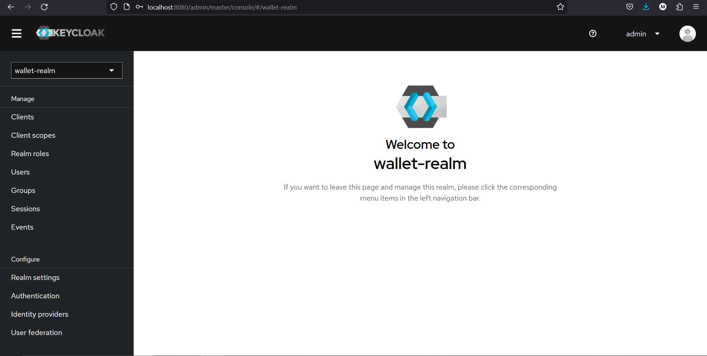
#### Create Client
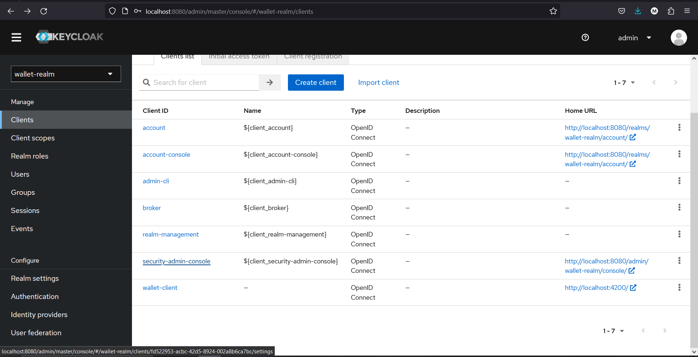
#### Create Users
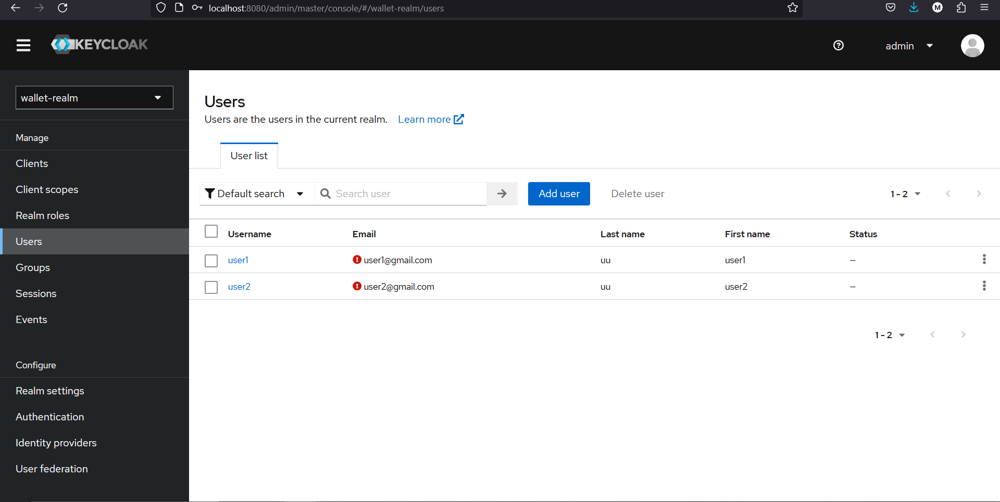
### Create Roles
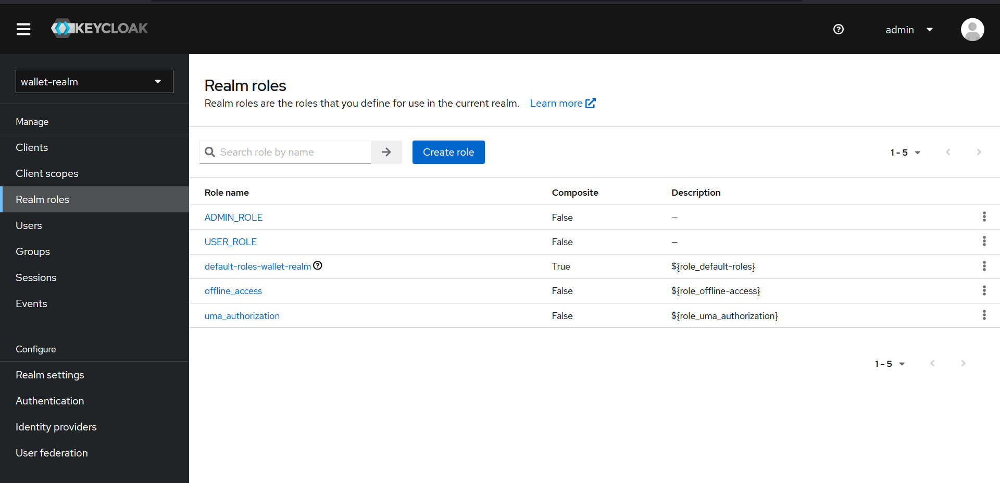
### Assign password to the uers
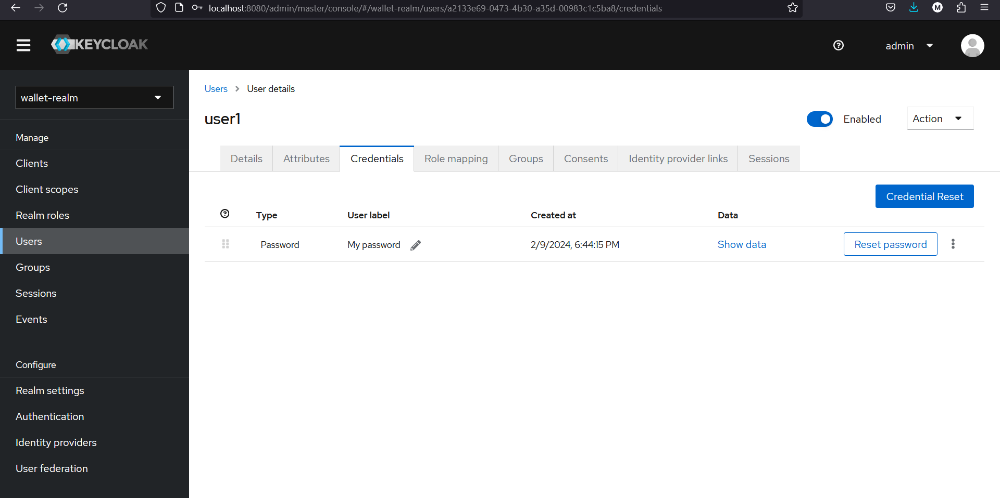
### Assign roles to the Users
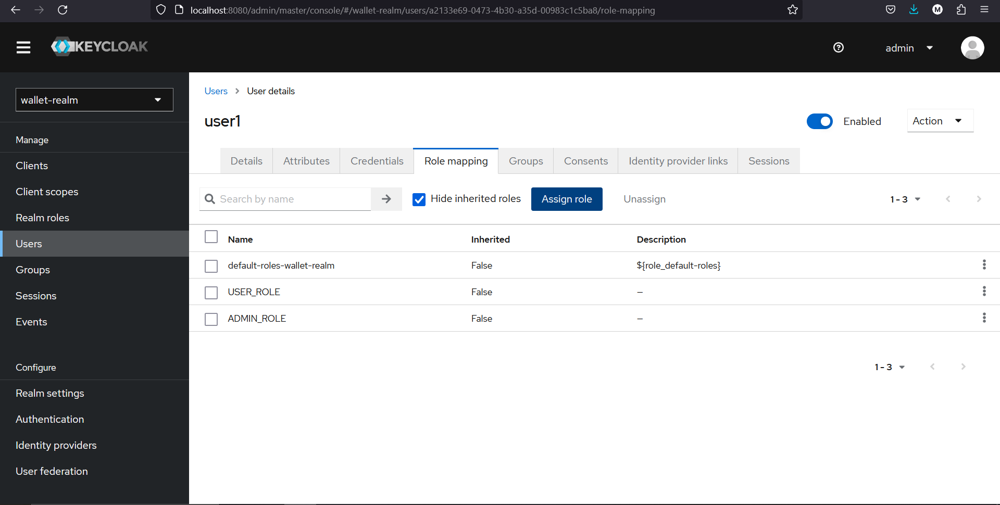
### Test authentication with password
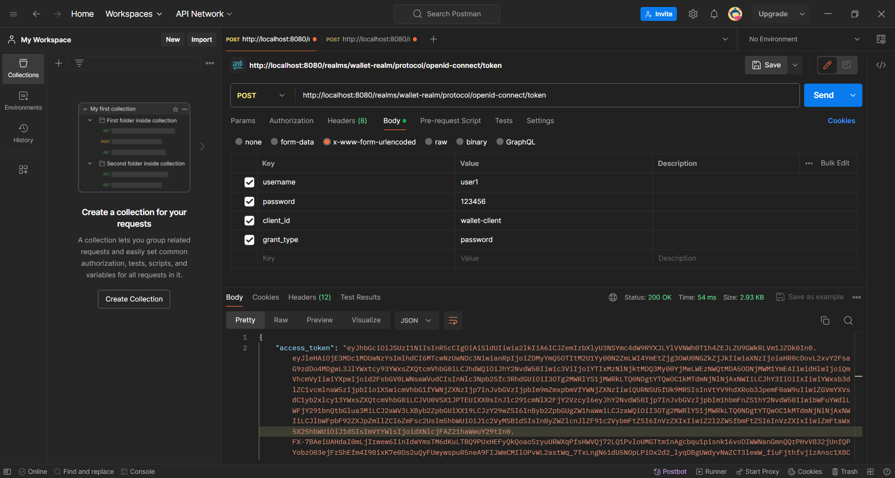
### Test authentication with the Refresh Token
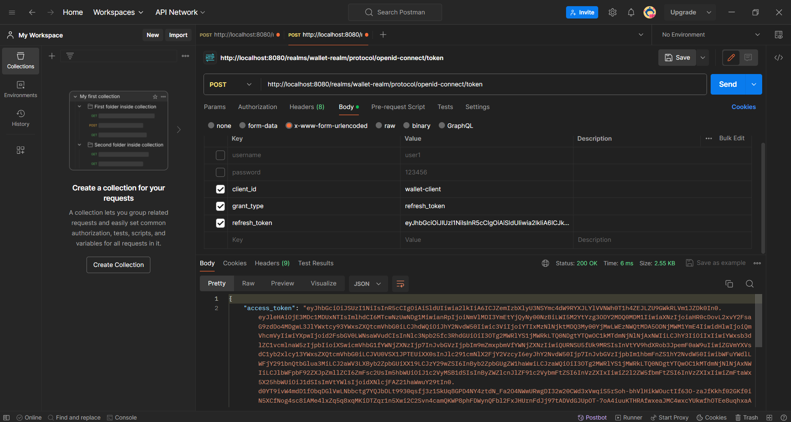
### Test authentication with Client ID and Client Secret
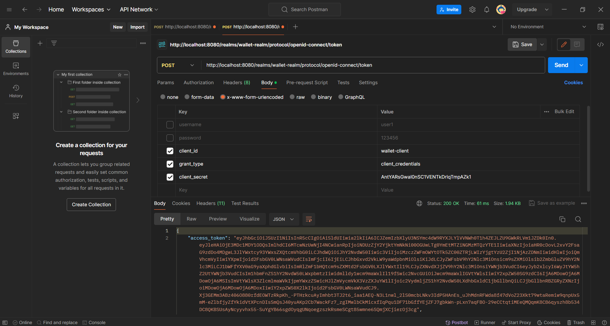
### 
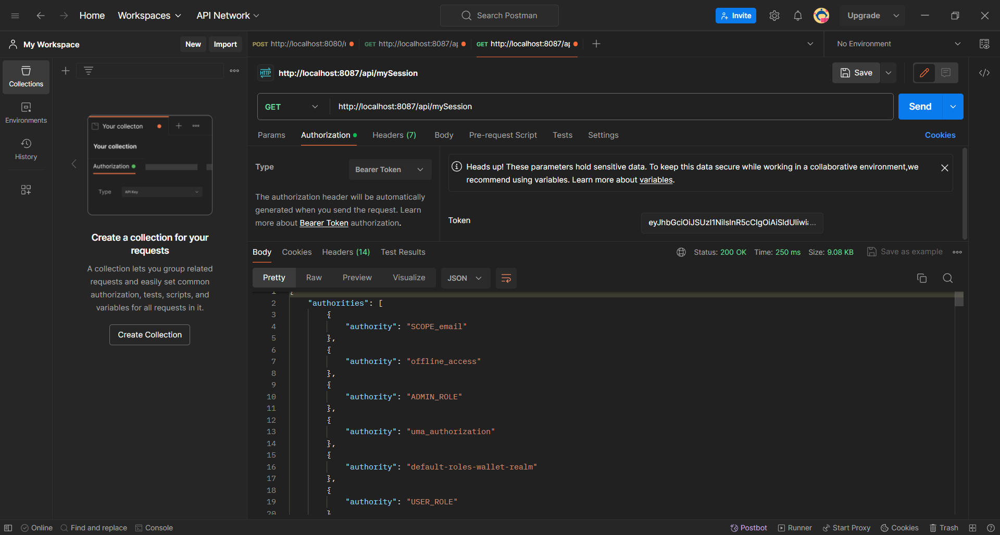
### 
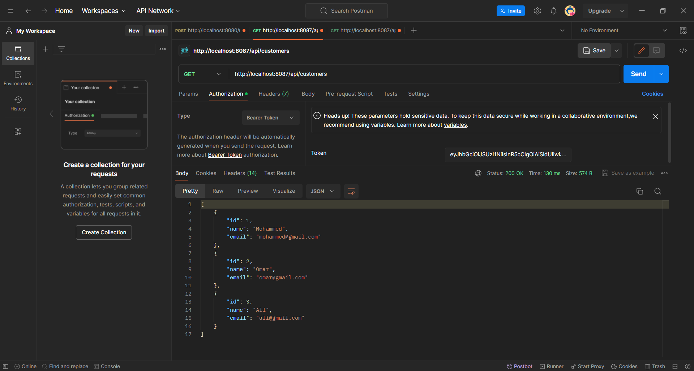

